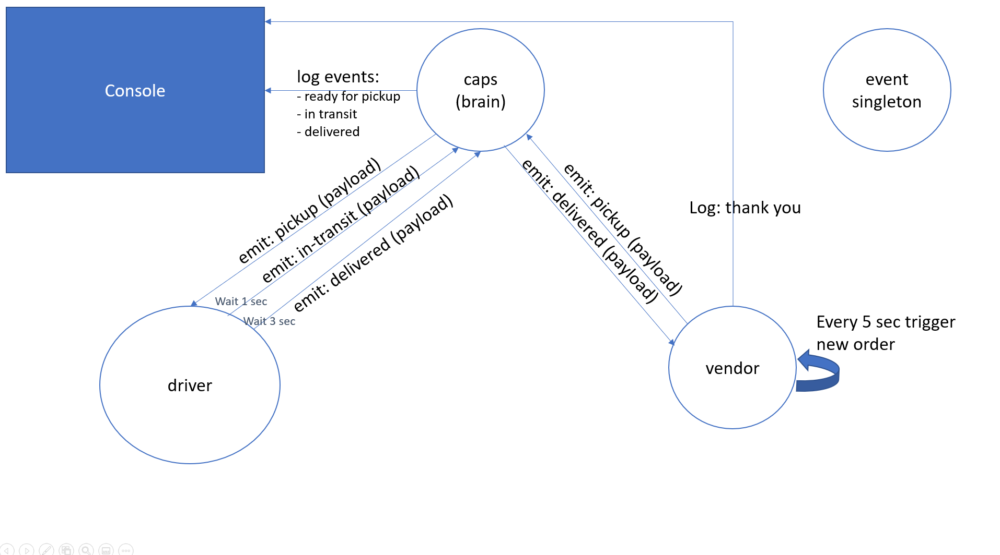

# LAB - Class 12

## Project: CAPS

### Author: Dina Ayoub

### Links and Resources

- [ci/cd](https://github.com/Dina-401-Advanced-Javascript/caps/actions) (GitHub Actions)
- [back-end server url](https://dina-caps.herokuapp.com/)

### Setup

#### `.env` requirements (where applicable)

For vendor:

- `STORE_NAME` - Name of your store
- `STORE_ID` - A unique ID for your store
- `PORT` - The port to connect to the server connections on.

For server:

- `PORT` - The port to accept connections on.

For driver:

- `PORT` - The port to connect to the server connections on.

#### How to initialize/run your application (where applicable)

`npm start` in each folder: src/caps, src/driver and src/vendor.

#### How to use your library (where applicable)

#### Tests

Run using:
`npm test` in each folder: src/caps, src/driver and src/vendor.

[x] Driver can pickup an order
[x] Driver can deliver an order
[x] Vendor can send an order to be picked up
[x] Vendor can thank driver
[x] CAPS can log an event

#### UML

